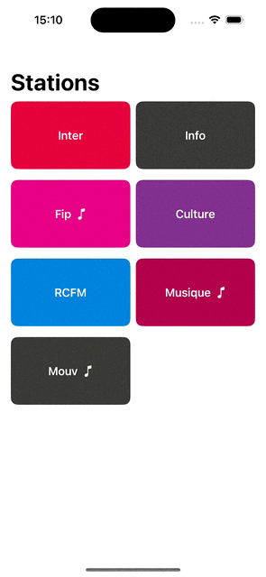

**Note**: UI tests are meant to be run on an iPhone 16 simulator, as they were recorded specifically for this device. Please ensure you are using the correct simulator to avoid those UI test errors.

# My Little Radio

This project is built with **SwiftUI** and **The Composable Architecture (TCA)**. It's a basic radio app that lists radio stations, allowing users to view details and play station streams. Since TCA was a new framework for me, I worked on balancing SwiftUI principles with TCA requirements, trying to keep things as simple and manageable as I could.

## Project Overview

- **Data Fetching**: Data is retrieved from a mock Node.js server that simulates an API calls, providing station information from `http://localhost/stations`.

### Features

- **Navigation to Detail View**: Selecting a station opens a detail view with the full station name and playback controls.
- **Audio Playback**: Audio streaming functionality was built using an AVPlayer trying to fit into a TCA Feature which manage play/pause actions and state updates.
- **UI**: I experimented with SwiftUI's design capabilities, focusing on layout, colors, and basic animations. This is my first real experience with SwiftUI, so I didn't push things too hard.

  

  <em>Final result</em>

## What I Did

1. **Fully Modularized**: Each feature is fully modularized, with concerns split, ensuring scalability and making shared components like the `AudioPlayer` or `Networking` modules easily reusables across the app.

2. **Fully Tested**: All app features are fully tested, and views are covered by screenshot tests to ensure consistent UI across updates.

3. **Integration with Mock Server**: Replaced the mock data with live data from a local server. Added a simulated loader and an error-handling popup with a retry option.
   
4. **Navigation with Detail View**: Integrated navigation to a `StationDetailsView` for each station. Initially tried a hero animation but encountered display artifacts, so I reverted to using a sheet.

5. **Audio Streaming**: Using `AudioPlayerFeature`, users can play and pause streams directly from the detail view. This TCA feature handles state updates in line with play/pause controls.

6. **Mini Player**: Integrated a mini player to a `StationView`. It is showing the current playing station with a play pause button.

7. **Animations**: I leverage SwiftUI animation capabilities to animate the play/pause button and the playing spectrum side to the playing station.

8. **Accessibility**: Added a little accessibility label on radio station cards to support VoiceOver for people which needs it.

## Challenges

### Managing TCA State and Dependencies

With multiple features needing to interact and share state, managing dependencies like `audioPlayerClient` was occasionally challenging, especially when working with mock data in tests. Having `AppFeature` manage multiple feature states was useful but can become overwhelming if the app grows and will need modularisation

### SwiftUI Animations

Being new to SwiftUI, I experimented with various animations, including the `matchedGeometryEffect` for a hero-style animation, but eventually opted for a more straightforward sheet presentation due to artifact issues.

  

  <em>Hero animation using matchedGeometryEffect. I switched to a sheet due to display issues.</em>

### Testing with XCTest

Switching to XCTest rather than swift testing for speed, and few ressources where available online.
Also Leveragng TCA `TestStore` to test features.

## What I Learned

With this project  I tried to plugin SwiftUI’s declarative style TCA structure. I started to learn state management, actions, reducers and manage navigation via sheets. 

I also hard learned the importance of delivering a clean, well-organized technical test.

## Additional Work Since Friday

1. **Refactored Dependencies**: Fully modularized the app, organizing dependencies cleanly across modules.

2. **Mini Player**: Added a mini player to the station list screen, bringing playback controls directly to this screen.

3. **Improved Code Structure**: Enhanced code organization and more effectively applied TCA principles across the app.

4. **Animations**: Added a pulse animation around the play/pause button to visually reflect the audio playback.

5. **Minor UI Adjustments**: Tweaked colors, padding, and font sizes in the list and detail views to improve visual hierarchy and overall aesthetics.

## Moving Forward

1. **Dynamic Island Support**: Extend audio playback controls to the Dynamic Island for a better user experience.
2. **Advanced Animations**: Improve animations by exploring `matchedGeometryEffect` more thoroughly.
3. **Enhanced Design**: Experiment more with SwiftUI design to improve the visual layout, especially around audio player indicators and station cards.
4. **Localisation**: Utilize `.xcstrings` files for type-safe localization management.

## Time Spent

- **Day 1 (4 hours)**: Familiarized myself with TCA, initial API setup, and basic UI.
- **Day 2 (3 hours)**: Experimented with animations, encountering some issues with `matchedGeometryEffect`.
- **Day 3 (3 hours)**: Integrated the audio player feature and get back to bottom-sheet navigation.
- **Day 4 (2 hours)**: Implemented tests and worked on readme.
- **Day 5 (5 hours)**: Modularized Networking, AudioPlayer, Core, View and ViewDetails features
- **Day 6 (3 hours)**: Add the Miniplayer and button animations. Clean SwiftUI code. 
- **Day 7 (1,5 hours)**: Worked on readme and cleaned the last bit of code.